# Paso 10 – Pipeline metodológico

Descripción del flujo completo del Hito 1, desde la descarga hasta las métricas, para la presentación y para la sección 3 del artículo. El diagrama para diapositivas está en `figures/plots/hito1_11_pipeline.png`.

## Diagrama

```mermaid
flowchart LR
    A["1. Datos OSM<br/>límites, grafo walk, POI<br/>(Colab: 01, 01b, 02a)"] --> B["2. Respaldo<br/>GraphML/GeoPackage + log + SHA-256"]
    B --> C["3. Limpieza y proyección<br/>EPSG:32718 (01)"]
    C --> D["4. Integración de POI<br/>deduplicación + nodo más cercano (02b)"]
    D --> E["5. Construcción de la red<br/>DiGraph ponderado por tiempo (02c)"]
    E --> F["6. Análisis exploratorio (03)"]
    F --> G["7. Métricas globales y locales (03)"]
    G --> H["Figuras (03b) y hallazgos"]
    H -. Hito 2 .-> I["Isócronas 5/10/15 min,<br/>cobertura y comparación"]
```

## Etapas

| # | Etapa | Notebook | Entradas | Salidas | Parámetros clave |
|---|---|---|---|---|---|
| 1 | Descarga de datos | `01`, `01b`, `02a` (Colab) | Nominatim y Overpass (vía osmnx) | Grafo crudo, límites, POI y capas de contexto, comparación sin simplificar | `network_type='walk'`, `simplify=True`, `retain_all=True`, buffer del grafo 300 m, buffer de POI 1 200 m |
| 2 | Respaldo | `01`, `02a`, `01b` | Descarga | `data/raw/*` y logs JSON con fecha, consulta y versiones (SHA-256 en `01` y `02a`) | – |
| 3 | Limpieza y proyección | `01` | `walk_graph_raw.graphml` | `data/interim/walk_graph_clean.graphml`, `data/processed/limpieza_registro.csv` | CRS EPSG:32718; componente principal por distrito; sin bucles ni paralelas |
| 4 | Integración de POI | `02b` | `poi_osm.gpkg`, grafo limpio | `data/processed/poi_snap.csv`, `poi_resumen.csv` | deduplicación a 100 m; snap ≤ 100 m |
| 5 | Construcción de la red | `02c` (`src/red.py`) | Grafo limpio, POI integrados | `DiGraph` con `tiempo_min` y conteo de POI por nodo | 4.8 km/h = 80 m/min |
| 6 | Análisis exploratorio | `03` | Grafo limpio, POI | Tablas y figuras `eda_*`, `eda_comparacion_distritos.csv` | celdas de 100 y 250 m |
| 7 | Métricas | `03` | Subgrafos por distrito | `metricas_globales.csv`, `metricas_nodos.csv`, `metricas_error_betweenness.csv`, figuras `metricas_*` | intermediación `k = 500`, semilla 42 |
| 8 | Figuras finales | `03b` | Todo lo anterior | Figuras `hito1_*`, `figures/CATALOGO.md` | 200 dpi |

## Decisiones metodológicas y su justificación

- **Red peatonal (`walk`):** el tema exige accesibilidad a pie.
- **Dos distritos no contiguos:** se descarga con `retain_all=True` para no perder ninguno; se conserva el componente principal de cada distrito y el análisis es por distrito. Los distritos son redes independientes.
- **Buffer de 300 m sin recortar:** los nodos del buffer (`Fuera (buffer)`) sirven para el ruteo y no entran en las métricas por distrito, para limitar el efecto de borde. La posible ampliación del grafo se evalúa en el Hito 2 (`docs/hito2/01_nota_ampliar_grafo.md`).
- **`simplify=True`:** reduce los nodos en un 58 % conservando intersecciones y longitud total, y hace comparables las densidades entre distritos (sección final de `01`).
- **Grafo dirigido y simétrico:** en `walk` osmnx ignora `oneway`; se verificó que el 100 % de las aristas tiene inversa con la misma longitud.
- **Peso = tiempo de caminata** con velocidad constante de 4.8 km/h; no considera pendiente, cruces ni escaleras (limitación declarada).
- **Normalización:** toda densidad se expresa por km² del distrito; las centralidades de cercanía e intermediación no se comparan en valor absoluto entre distritos.
- **Intermediación aproximada** con `k = 500` orígenes, ponderada por longitud y con semilla fija; el error se midió contra la exacta de Miraflores.

## Controles de calidad incluidos en el pipeline

| Control | Dónde | Qué comprueba |
|---|---|---|
| SHA-256 y log de cada descarga | `01`, `02a` (con hash); `01b` (solo log) | Que el archivo en disco es el descargado |
| Cobertura de ambos distritos | `01` (descarga) | Falla si algún distrito queda sin nodos (evita repetir el error de `retain_all=False`) |
| Razón longitud proyectada / `length` | `01` | Que la proyección es correcta (0.995–1.001, ninguna arista con más de 1 % de diferencia) |
| Verificaciones finales de limpieza | `01` | ≥ 3 000 nodos y ≥ 6 000 aristas, CRS 32718, un componente por distrito |
| Recarga del grafo limpio | `01` | Que el archivo exportado se puede volver a leer con osmnx |
| Tiempo vs. longitud | `02c` | Que Dijkstra por tiempo y por longitud dan los mismos nodos a 5, 10 y 15 min |
| Error de la intermediación aproximada | `03` | Spearman 0.989 y coincidencia del 91 % en el 5 % más central, con `k = 500` |

## Ejecución y entorno

- **Con acceso a Overpass (Colab):** las celdas de descarga de `01`, y los notebooks `01b` y `02a`. Entorno de Colab: Python 3.13.15, osmnx 2.1.1, networkx 3.6.1, geopandas 1.1.4, numpy 2.1.3, pandas 2.2.3.
- **Local, sin red:** carga y limpieza de `01`, `02b`, `02c`, `03` y `03b`. Entorno: Python 3.12.2, osmnx 2.1.1, networkx 3.6.1, geopandas 1.2.0, numpy 2.4.4, pandas 3.0.3.
- **Orden de ejecución:** `01` (descarga, luego limpieza) → `02a` → `02b` → `02c` → `03` → `03b`; `01b` es independiente.
- **Semilla:** 42 (`src/config.py`).
- **Datos:** `data/raw` e `data/interim` y los GeoPackage no se suben a Git; el log con el hash permite verificar los archivos. Se versionan los logs, las tablas pequeñas y las figuras.

## Limitaciones del pipeline

- La descarga depende de que Overpass esté disponible; desde el equipo local falló, por lo que se hizo en Colab y los archivos se copiaron a mano.
- OSM cambia con el tiempo: dos descargas con 1.5 h de diferencia ya difirieron en 47 nodos del buffer. El análisis usa la descarga del 2026-10-03 21:50 UTC.
- `requirements.txt` aún no fija versiones exactas (pendiente en el paso 12).
